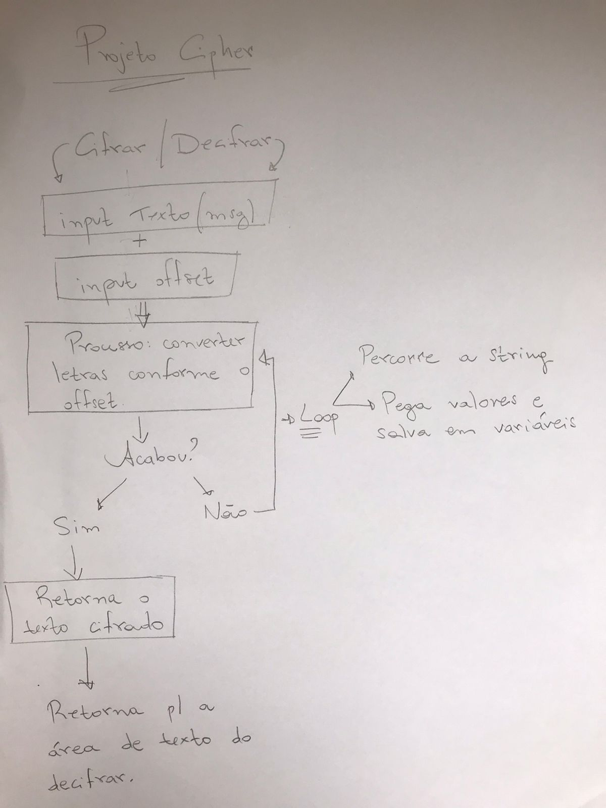
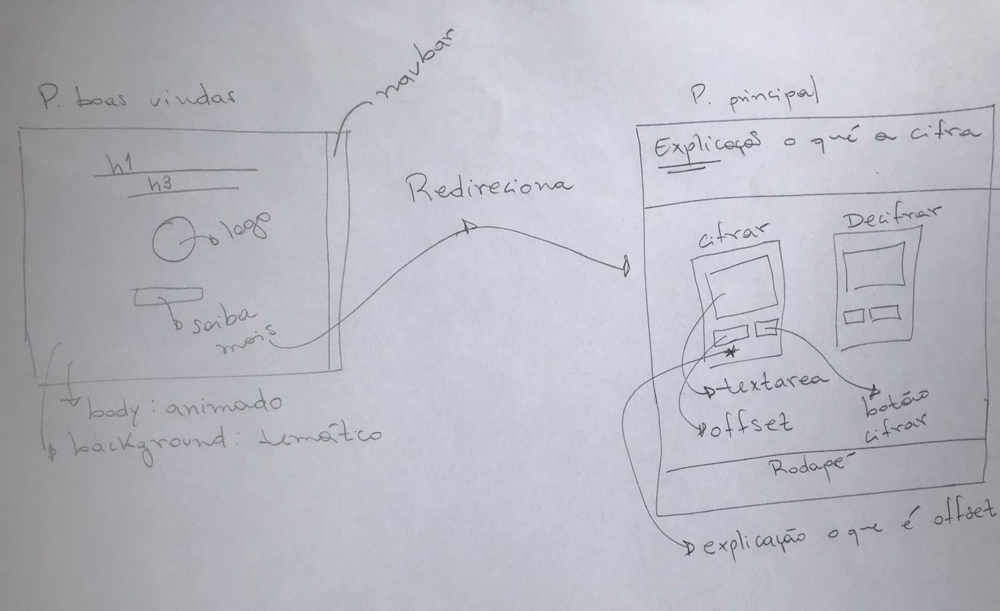
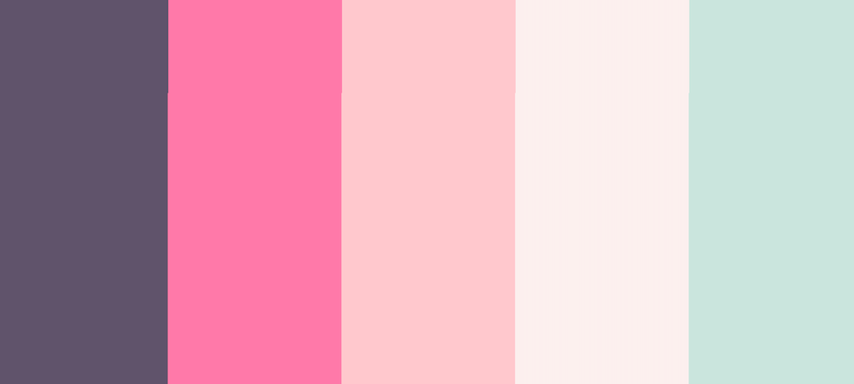
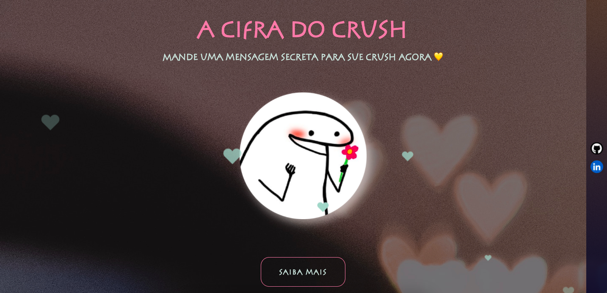

# A Cifra do Crush

### Projeto #1: Cipher. Desenvolvido para o Bootcamp Laboratória

## Índice

- [1. Proposta do projeto](#1-proposta-do-projeto)
- [2. Usuário](#2-usuário)
- [3. Fluxograma do algoritmo](#3-fluxograma-do-algoritmo)
- [4. Protótipo do projeto](#4-protótipo-do-projeto)
- [5. Tecnologias](#5-tecnologias)
- [6. Resultado](#6-resultado)
- [7. Sobre a desenvolvedora](#7-sobre-a-desenvolvedora)

---

## 1. Proposta do Projeto

Cifrar significa codificar. A [cifra de César](https://pt.wikipedia.org/wiki/Cifra_de_C%C3%A9sar)
é um dos primeiros tipos de criptografias conhecidas na história.
O imperador romano Júlio César utilizava essa cifra para enviar
ordens secretas aos seus generais no campo de batalha.

A cifra de César é uma das técnicas mais simples de cifrar uma mensagem. É um
tipo de cifra por substituição, em que cada letra do texto original é
substituida por outra que se encontra há um número fixo de posições
(deslocamento) mais a frente do mesmo alfabeto.

Por exemplo se usarmos o deslocamento (_offset_) de 3 posições:

- Alfabeto sem cifrar: A B C D E F G H I J K L M N O P Q R S T U V W X Y Z
- Alfabeto com cifra: D E F G H I J K L M N O P Q R S T U V W X Y Z A B C
- A letra A será D
- A palavra CASA será FDVD

Atualmente todas as cifras de substituição alfabética simples, são decifradas
com facilidade e não oferecem muita segurança na comunicação por si mesma,
mas a cifra de César muitas vezes pode fazer parte de um sistema
mais complexo de criptografia, como
a cifra de Vigenère, e tem aplicação no sistema ROT13.

## 2. Usuário

Demonstrar interesse nem sempre é uma tarefa fácil... Especialmente para os mais tímidos. Pensando em uma maneira de quebrar esse o gelo inicial, surgiu "A Cifra do Crush", uma forma diferente de iniciar uma conversa com o seu crush.

O usuário poderá cifrar e decifrar um texto indicando a chave de deslocamento (_offset_).

### **✅ Como acredito que o produto está resolvendo os problemas do usuário?**

Acredito no poder da comunicaçao e imagino quantas coisas poderiam ser diferentes se soubéssemos nos expressar. Das relações de trabalho ao romance: tudo poderia ser melhor.

Pensando então nas dificuldades que o usuário tem em se comunicar, e mais específico, expressar seus sentimentos, e por isso deixa passar oportunidades de viver histórias incríveis -, o produto visa ser um ponto de partida para estabelecer uma conexão inicial entre o usuário e seu/sua crush.

### **✅ Quem são os principais usuários do produto?**

Pessoas tímidas ou não que buscam uma forma inusitada de quebrar o gelo para inicar um diálogo com outra pessoa.

### **✅ Quais são os objetivos do usuário em relação com o produto?**

Superar o desafio de quebrar o silêncio e de demonstrar o interesse romântico para outra pessoa.

## 3. Fluxograma do algoritmo

## 4. Protótipo do projeto

### Paleta de cores

## 5. Tecnologias

   

   

  

 

 

## 6. Resultado
Projeto desenvolvido em 3 sprints.

<a height="30px" placeholder="ola" href="https://github.com/lalaonde/SAP007-cipher/deployments/activity_log?environment=github-pages">Veja aqui!</a> 

#### **Parte Opcional "Hacker edition" cumprida**

✅ Cifrar/decifrar minúsculas.  

## 7. Sobre a desenvolvedora
Olá! Sou aluna do bootcamp Laborátoria, focado em desenvolvimento Javascript e este foi o primeiro projeto.

